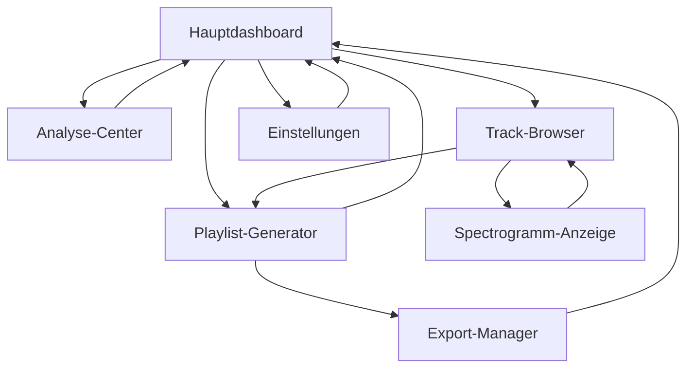

# Audio-Analyse-Tool - Produktdokumentation

## 1. Product Overview

Ein lokal ausführbares Python-Desktop-Tool für Windows, das Musikbibliotheken intelligent analysiert und kategorisiert. Das Tool ermöglicht DJs und Musikproduzenten die automatische Analyse ihrer MP3-Sammlung nach musikalischen Parametern und generiert daraus intelligente, regelbasierte Playlists.

Zielgruppe: DJs, Musikproduzenten und Audio-Enthusiasten, die ihre lokale Musikbibliothek professionell organisieren und für Live-Sets oder Produktionen optimieren möchten.

## 2. Core Features

### 2.1 User Roles

| Role | Registration Method | Core Permissions |
|------|---------------------|------------------|
| Standard User | Lokale Installation | Vollzugriff auf alle Analyse- und Playlist-Funktionen |

### 2.2 Feature Module

Unser Audio-Analyse-Tool besteht aus folgenden Hauptseiten:

1. **Hauptdashboard**: Musikbibliothek-Übersicht, Track-Visualisierung, Schnellzugriff auf Funktionen
2. **Analyse-Center**: Audio-Analyse-Engine, Batch-Processing, Fortschrittsanzeige
3. **Playlist-Generator**: Regel-Engine, Parameter-Dashboard, Vorschau-Bereich
4. **Track-Browser**: Detailansicht, Sortier- und Filterfunktionen, Spectrogramm-Anzeige
5. **Export-Manager**: Format-Auswahl, Rekordbox-Kompatibilität, Batch-Export
6. **Einstellungen**: Preset-Management, Audio-Parameter, GUI-Konfiguration

### 2.3 Page Details

| Page Name | Module Name | Feature description |
|-----------|-------------|---------------------|
| Hauptdashboard | Bibliothek-Übersicht | Zeige analysierte Tracks in Tabellenform mit BPM, Tonart, Energie-Level. Sortierbar nach allen Parametern |
| Hauptdashboard | Schnellstatistiken | Anzeige Gesamtanzahl Tracks, durchschnittliche BPM, Tonart-Verteilung als Charts |
| Hauptdashboard | Letzte Aktivitäten | Historie der letzten Analysen und generierten Playlists |
| Analyse-Center | Audio-Engine | Analysiere MP3-Files mit essentia/librosa für Tonart, BPM, Helligkeit, Harmonik, Energie-Level, Stimmung |
| Analyse-Center | Batch-Processing | Verarbeite komplette Ordner, Fortschrittsbalken, Fehlerbehandlung für korrupte Files |
| Analyse-Center | JSON-Caching | Speichere Analyse-Ergebnisse als JSON pro Track für schnelle Wiederverwendung |
| Playlist-Generator | Regel-Engine | Definiere BPM-Range (Slider), Tonart-Kompatibilität (Camelot Wheel), Stimmung, Energie-Level |
| Playlist-Generator | Parameter-Dashboard | Dropdowns für Stimmung (düster, euphorisch, treibend), Sliders für BPM und Energie |
| Playlist-Generator | Intelligente Sortierung | Automatische Anordnung nach BPM-Flow, Energie-Verlauf, Tonart-Harmonie |
| Playlist-Generator | Preset-Management | Speichere und lade Regel-Sets (Push-Push, Dark, Driving, Experimental) |
| Track-Browser | Detailansicht | Vollständige Track-Informationen, Metadaten, Analyse-Ergebnisse |
| Track-Browser | Filter-System | Mehrfach-Filter nach BPM, Tonart, Stimmung, Energie, Dateiformat |
| Track-Browser | Spectrogramm-Anzeige | Visuelle Darstellung der Frequenz-Analyse, Waveform-Preview |
| Export-Manager | Rekordbox-Export | Generiere M3U und XML-Playlists kompatibel mit Rekordbox |
| Export-Manager | Format-Optionen | Unterstütze verschiedene Playlist-Formate, Pfad-Anpassungen |
| Export-Manager | Batch-Export | Exportiere mehrere Playlists gleichzeitig |
| Einstellungen | Audio-Parameter | Konfiguriere Analyse-Algorithmen, Schwellenwerte, Genauigkeit |
| Einstellungen | GUI-Konfiguration | Theme-Auswahl, Layout-Optionen, Sprach-Einstellungen |
| Einstellungen | Pfad-Management | Musikbibliothek-Pfade, Export-Verzeichnisse, Cache-Location |

## 3. Core Process

**Standard User Flow:**
1. User startet die Anwendung und wählt Musikbibliothek-Ordner
2. Audio-Analyse wird gestartet - essentia/librosa analysiert alle MP3-Files
3. Ergebnisse werden als JSON gecacht und in der Hauptübersicht angezeigt
4. User definiert Playlist-Regeln über Parameter-Dashboard
5. Intelligente Playlist wird generiert und in Vorschau angezeigt
6. User exportiert Playlist in Rekordbox-kompatiblem Format

**Mix-Vorschlag Flow:**
1. User wählt Start-Track aus der Bibliothek
2. System analysiert Tonart und BPM des Start-Tracks
3. Automatische Vorschläge für harmonisch kompatible Follow-Up-Tracks
4. User kann Vorschläge akzeptieren oder manuell anpassen

## 4. User Interface Design

### 4.1 Design Style

- **Primärfarben**: Dunkles Theme mit #1a1a1a (Hintergrund), #2d2d2d (Panels), #0066cc (Akzente)
- **Sekundärfarben**: #ff6b35 (Warnungen), #4caf50 (Erfolg), #ffffff (Text)
- **Button-Style**: Moderne, flache Buttons mit abgerundeten Ecken (border-radius: 4px)
- **Schriftart**: Segoe UI (Windows), Größen: 12px (Standard), 14px (Überschriften), 10px (Labels)
- **Layout**: Card-basiertes Design mit Top-Navigation, Sidebar für Hauptfunktionen
- **Icons**: Material Design Icons, Musik-spezifische Symbole (🎵, 🎧, 📊)

### 4.2 Page Design Overview

| Page Name | Module Name | UI Elements |
|-----------|-------------|-------------|
| Hauptdashboard | Bibliothek-Übersicht | DataGrid mit sortable columns, Dark theme, BPM/Key color-coding |
| Hauptdashboard | Schnellstatistiken | Card-Layout mit Charts (Pie, Bar), Gradient backgrounds #1a1a1a to #2d2d2d |
| Analyse-Center | Audio-Engine | Progress bars mit #0066cc, Status-Logs in monospace font, Real-time updates |
| Playlist-Generator | Parameter-Dashboard | Range sliders mit #0066cc handles, Dropdown menus mit dark styling |
| Playlist-Generator | Camelot Wheel | Interactive circular wheel, color-coded keys, hover effects |
| Track-Browser | Spectrogramm | Canvas-based visualization, frequency colors from blue to red gradient |
| Export-Manager | Format-Optionen | Radio buttons, file path inputs, preview panels mit #2d2d2d background |
| Einstellungen | Konfiguration | Tabbed interface, toggle switches, input fields mit validation styling |

### 4.3 Responsiveness

Desktop-first Design optimiert für Windows 10/11. Minimale Fenstergröße: 1024x768px. Touch-Interaktion nicht erforderlich, da primär für Desktop-DJ-Setups konzipiert. Skalierbare UI-Elemente für verschiedene Monitor-Auflösungen.