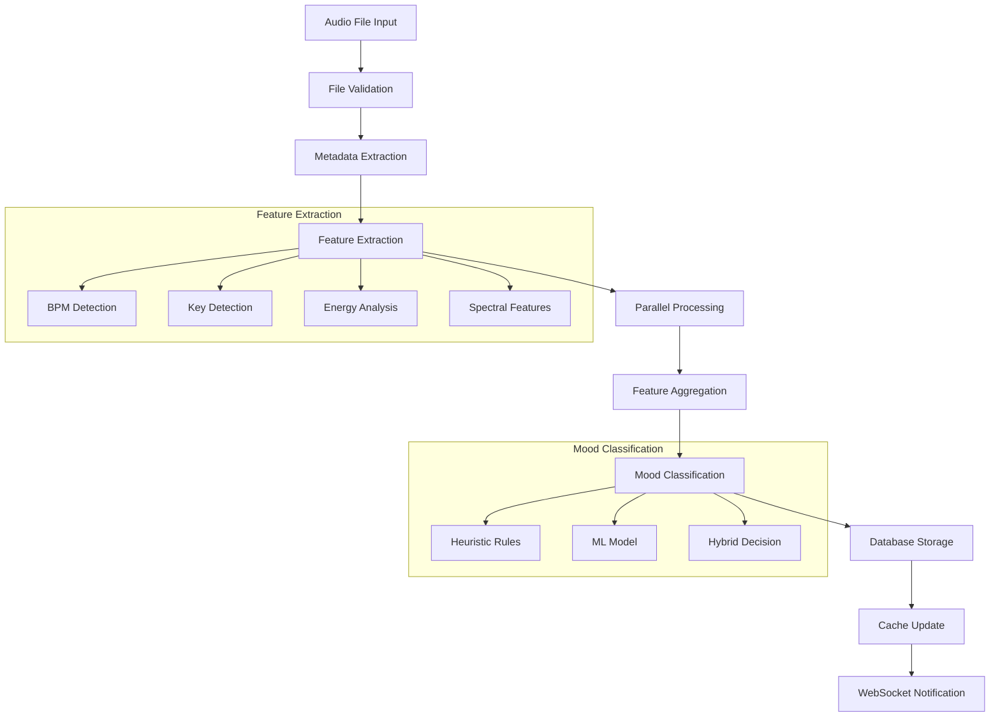
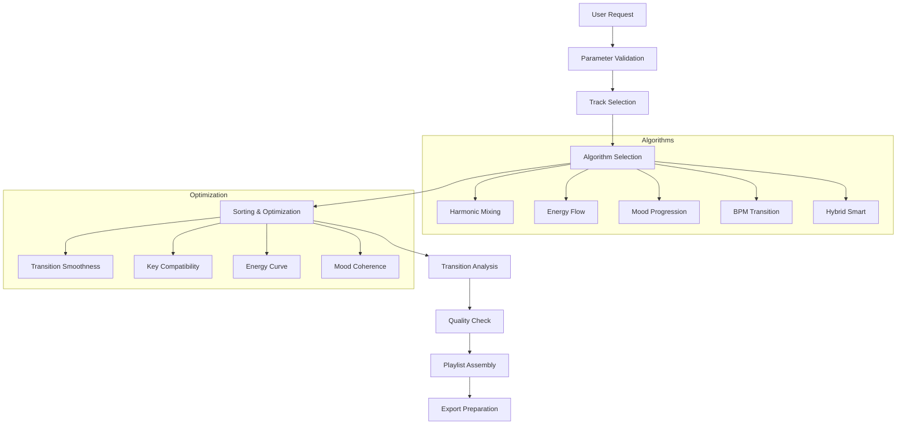

# DJ Audio-Analyse-Tool Pro - Technische Architektur

## Executive Summary

Das DJ Audio-Analyse-Tool Pro ist eine hochperformante, modulare Anwendung für professionelle Audio-Analyse und intelligente Playlist-Generierung. Die Architektur folgt dem Prinzip der Separation of Concerns mit klarer Trennung zwischen Frontend, API-Layer, Business Logic und Datenmanagement.

---

## Architektur-Prinzipien

### 1. Modulare Architektur
- **Lose Kopplung**: Komponenten sind über definierte Interfaces verbunden
- **Hohe Kohäsion**: Verwandte Funktionalitäten sind in Modulen gruppiert
- **Dependency Injection**: Konfigurierbare Abhängigkeiten
- **Plugin-fähig**: Erweiterbare Architektur für neue Features

### 2. Performance-orientiert
- **Multiprocessing**: Parallele Audio-Verarbeitung
- **Intelligentes Caching**: Multi-Level Cache-System
- **Asynchrone Verarbeitung**: Non-blocking I/O Operations
- **Optimierte Datenstrukturen**: Effiziente Speicher- und CPU-Nutzung

### 3. Skalierbarkeit
- **Horizontale Skalierung**: Microservice-ready Architektur
- **Vertikale Skalierung**: Optimierte Ressourcennutzung
- **Load Balancing**: Verteilte Verarbeitung möglich
- **Cloud-ready**: Container-basierte Deployment-Strategie

---

## System-Komponenten im Detail

### Backend-Architektur

```
┌─────────────────────────────────────────────────────────────┐
│                    FastAPI Application                     │
│  ┌─────────────┐ ┌─────────────┐ ┌─────────────────────┐   │
│  │ Middleware  │ │ API Router  │ │ WebSocket Handler   │   │
│  │ - CORS      │ │ - Endpoints │ │ - Real-time Updates │   │
│  │ - Auth      │ │ - Validation│ │ - Heartbeat         │   │
│  │ - Logging   │ │ - Docs      │ │ - Status Broadcast  │   │
│  └─────────────┘ └─────────────┘ └─────────────────────┘   │
└─────────────────────┬───────────────────────────────────────┘
                      │
┌─────────────────────▼───────────────────────────────────────┐
│                   Core Engine                              │
│  ┌─────────────────┐ ┌─────────────────┐ ┌─────────────────┐│
│  │ Audio Analysis  │ │ Playlist Engine │ │ Mood Classifier ││
│  │ ┌─────────────┐ │ │ ┌─────────────┐ │ │ ┌─────────────┐ ││
│  │ │ Analyzer    │ │ │ │ Algorithms  │ │ │ │ Heuristic   │ ││
│  │ │ Extractor   │ │ │ │ Presets     │ │ │ │ ML Model    │ ││
│  │ │ Validator   │ │ │ │ Rules       │ │ │ │ Hybrid      │ ││
│  │ └─────────────┘ │ │ └─────────────┘ │ │ └─────────────┘ ││
│  └─────────────────┘ └─────────────────┘ └─────────────────┘│
└─────────────────────┬───────────────────────────────────────┘
                      │
┌─────────────────────▼───────────────────────────────────────┐
│                Data Management                              │
│  ┌─────────────────┐ ┌─────────────────┐ ┌─────────────────┐│
│  │ Database Mgr    │ │ Cache Manager   │ │ Export Engine   ││
│  │ - SQLite        │ │ - Memory Cache  │ │ - M3U           ││
│  │ - Migrations    │ │ - Disk Cache    │ │ - JSON          ││
│  │ - Indexing      │ │ - Compression   │ │ - CSV           ││
│  │ - Transactions  │ │ - TTL           │ │ - Rekordbox     ││
│  └─────────────────┘ └─────────────────┘ └─────────────────┘│
└─────────────────────────────────────────────────────────────┘
```

### Frontend-Architektur

```
┌─────────────────────────────────────────────────────────────┐
│                    React Application                       │
│  ┌─────────────┐ ┌─────────────┐ ┌─────────────────────┐   │
│  │ App Router  │ │ State Mgmt  │ │ UI Components       │   │
│  │ - Routes    │ │ - React     │ │ - Material-UI       │   │
│  │ - Guards    │ │ - Query     │ │ - Custom Hooks      │   │
│  │ - Lazy Load │ │ - Context   │ │ - Responsive Design │   │
│  └─────────────┘ └─────────────┘ └─────────────────────┘   │
└─────────────────────┬───────────────────────────────────────┘
                      │
┌─────────────────────▼───────────────────────────────────────┐
│                  Service Layer                             │
│  ┌─────────────────┐ ┌─────────────────┐ ┌─────────────────┐│
│  │ API Client      │ │ WebSocket       │ │ Utils & Helpers ││
│  │ - HTTP Client   │ │ - Real-time     │ │ - Formatters    ││
│  │ - Error Handler │ │ - Reconnection  │ │ - Validators    ││
│  │ - Interceptors  │ │ - Event Handler │ │ - Constants     ││
│  └─────────────────┘ └─────────────────┘ └─────────────────┘│
└─────────────────────────────────────────────────────────────┘
```

---

## Datenfluss-Architektur

### 1. Audio-Analyse-Pipeline



### 2. Playlist-Generierung-Pipeline



---

## Performance-Optimierungen

### 1. Audio-Verarbeitung

**Multiprocessing-Strategie**:
```python
class AudioAnalyzer:
    def __init__(self):
        self.max_workers = min(cpu_count(), 8)
        self.chunk_size = 10  # Files per worker
        
    def analyze_batch(self, files):
        chunks = self._create_chunks(files, self.chunk_size)
        with ProcessPoolExecutor(max_workers=self.max_workers) as executor:
            futures = [executor.submit(self._analyze_chunk, chunk) 
                      for chunk in chunks]
            return self._collect_results(futures)
```

**Memory-Management**:
- Streaming Audio Processing für große Dateien
- Garbage Collection nach jedem Batch
- Memory-mapped Files für Cache-Zugriff
- Lazy Loading von Audio-Daten

### 2. Caching-Strategie

**Multi-Level Cache**:
```python
class CacheManager:
    def __init__(self):
        self.memory_cache = LRUCache(maxsize=1000)
        self.disk_cache = DiskCache('data/cache')
        self.compression = True
        
    def get(self, key):
        # L1: Memory Cache
        if key in self.memory_cache:
            return self.memory_cache[key]
            
        # L2: Disk Cache
        if key in self.disk_cache:
            value = self.disk_cache[key]
            self.memory_cache[key] = value
            return value
            
        return None
```

**Cache-Invalidierung**:
- File-Modification-Time basierte Invalidierung
- Dependency-basierte Cache-Updates
- Automatische Cleanup-Routines
- Cache-Warming für häufig genutzte Daten

### 3. Database-Optimierungen

**Indexing-Strategie**:
```sql
-- Composite Indexes für häufige Queries
CREATE INDEX idx_tracks_bpm_energy ON tracks(bpm, energy);
CREATE INDEX idx_tracks_mood_key ON tracks(mood, musical_key);
CREATE INDEX idx_tracks_genre_artist ON tracks(genre, artist);

-- Partial Indexes für spezielle Cases
CREATE INDEX idx_tracks_analyzed ON tracks(file_path) 
WHERE analysis_status = 'completed';
```

**Query-Optimierung**:
- Prepared Statements für wiederkehrende Queries
- Batch-Inserts für bessere Performance
- Connection Pooling für Multiprocessing
- VACUUM und ANALYZE für Index-Optimierung

---

## Sicherheits-Architektur

### 1. Input-Validierung

**API-Level**:
```python
class TrackSearchRequest(BaseModel):
    query: Optional[str] = Field(None, max_length=255)
    bpm_min: Optional[float] = Field(None, ge=0, le=300)
    bpm_max: Optional[float] = Field(None, ge=0, le=300)
    
    @validator('bpm_max')
    def validate_bpm_range(cls, v, values):
        if 'bpm_min' in values and v < values['bpm_min']:
            raise ValueError('bpm_max must be >= bpm_min')
        return v
```

**File-System-Level**:
- Path-Traversal-Schutz
- File-Type-Validierung
- Size-Limits für Uploads
- Sandboxing für Audio-Processing

### 2. Error-Handling

**Graceful Degradation**:
```python
class AudioAnalyzer:
    def analyze_file(self, file_path):
        try:
            return self._full_analysis(file_path)
        except EssentiaError:
            logger.warning(f"Essentia failed for {file_path}, falling back to librosa")
            return self._librosa_analysis(file_path)
        except Exception as e:
            logger.error(f"Analysis failed for {file_path}: {e}")
            return self._minimal_analysis(file_path)
```

**Circuit Breaker Pattern**:
- Automatische Deaktivierung fehlerhafter Komponenten
- Fallback-Mechanismen für kritische Features
- Health-Checks für externe Dependencies
- Retry-Logic mit Exponential Backoff

---

## Monitoring und Observability

### 1. Logging-Architektur

**Structured Logging**:
```python
import structlog

logger = structlog.get_logger()

def analyze_track(file_path):
    logger.info(
        "Starting track analysis",
        file_path=file_path,
        file_size=os.path.getsize(file_path),
        operation="audio_analysis"
    )
```

**Log-Aggregation**:
- Centralized Logging mit ELK Stack (optional)
- Log-Rotation und Archivierung
- Error-Alerting bei kritischen Fehlern
- Performance-Metrics-Logging

### 2. Metrics und Monitoring

**Key Performance Indicators**:
```python
class PerformanceMetrics:
    def __init__(self):
        self.analysis_times = []
        self.cache_hit_rate = 0.0
        self.error_rate = 0.0
        self.throughput = 0.0
        
    def track_analysis_time(self, duration):
        self.analysis_times.append(duration)
        if len(self.analysis_times) > 1000:
            self.analysis_times = self.analysis_times[-1000:]
```

**Health-Checks**:
- Database-Connectivity
- Cache-Verfügbarkeit
- File-System-Zugriff
- Memory-Usage
- CPU-Load

---

## Deployment-Architektur

### 1. Container-Strategie

**Multi-Stage Docker Build**:
```dockerfile
# Build Stage
FROM python:3.9-slim as builder
WORKDIR /app
COPY requirements.txt .
RUN pip install --user -r requirements.txt

# Runtime Stage
FROM python:3.9-slim
WORKDIR /app
COPY --from=builder /root/.local /root/.local
COPY . .
EXPOSE 8000
CMD ["uvicorn", "main:app", "--host", "0.0.0.0"]
```

**Orchestration**:
```yaml
# docker-compose.yml
version: '3.8'
services:
  backend:
    build: ./backend
    environment:
      - DATABASE_URL=sqlite:///data/database.db
      - CACHE_DIR=/app/data/cache
    volumes:
      - ./data:/app/data
      - ./music:/app/music:ro
    
  frontend:
    build: ./src
    environment:
      - REACT_APP_API_URL=http://backend:8000/api
    depends_on:
      - backend
    
  nginx:
    image: nginx:alpine
    ports:
      - "80:80"
      - "443:443"
    volumes:
      - ./nginx.conf:/etc/nginx/nginx.conf
    depends_on:
      - frontend
      - backend
```

### 2. Skalierungs-Strategien

**Horizontal Scaling**:
- Load Balancer für API-Requests
- Shared Database für Konsistenz
- Distributed Cache (Redis) für Session-Management
- Message Queue für asynchrone Tasks

**Vertical Scaling**:
- CPU-optimierte Instanzen für Audio-Processing
- Memory-optimierte Instanzen für Cache
- SSD-Storage für Database und Cache
- GPU-Acceleration für ML-Models (optional)

---

## Erweiterbarkeit und Plugin-System

### 1. Plugin-Architektur

**Interface Definition**:
```python
from abc import ABC, abstractmethod

class AudioAnalysisPlugin(ABC):
    @abstractmethod
    def analyze(self, audio_data: np.ndarray, sr: int) -> Dict[str, Any]:
        pass
        
    @abstractmethod
    def get_features(self) -> List[str]:
        pass
        
    @property
    @abstractmethod
    def name(self) -> str:
        pass
```

**Plugin-Manager**:
```python
class PluginManager:
    def __init__(self):
        self.plugins = {}
        
    def register_plugin(self, plugin: AudioAnalysisPlugin):
        self.plugins[plugin.name] = plugin
        
    def analyze_with_plugins(self, audio_data, sr):
        results = {}
        for name, plugin in self.plugins.items():
            try:
                results[name] = plugin.analyze(audio_data, sr)
            except Exception as e:
                logger.error(f"Plugin {name} failed: {e}")
        return results
```

### 2. API-Erweiterungen

**Versionierung**:
```python
# API v1
@app.get("/api/v1/tracks")
async def get_tracks_v1():
    return legacy_track_format()
    
# API v2
@app.get("/api/v2/tracks")
async def get_tracks_v2():
    return enhanced_track_format()
```

**Feature-Flags**:
```python
class FeatureFlags:
    ENABLE_ML_MOOD_CLASSIFICATION = True
    ENABLE_ESSENTIA_ANALYSIS = False
    ENABLE_CLOUD_EXPORT = False
    
@app.get("/api/tracks/{track_id}/mood")
async def get_track_mood(track_id: str):
    if FeatureFlags.ENABLE_ML_MOOD_CLASSIFICATION:
        return ml_mood_classifier.classify(track_id)
    else:
        return heuristic_mood_classifier.classify(track_id)
```

---

## Fazit

Die Architektur des DJ Audio-Analyse-Tools Pro ist darauf ausgelegt, hohe Performance, Skalierbarkeit und Erweiterbarkeit zu bieten. Durch die modulare Struktur, intelligente Caching-Strategien und robuste Error-Handling-Mechanismen kann das System auch bei großen Musikbibliotheken zuverlässig arbeiten.

Die klare Trennung der Verantwortlichkeiten ermöglicht es, einzelne Komponenten unabhängig zu entwickeln, zu testen und zu deployen. Das Plugin-System und die API-Versionierung sorgen für Zukunftssicherheit und einfache Erweiterbarkeit.

---

*Architektur-Dokumentation erstellt am: $(date)*
*Version: 2.0.0*
*Autor: System Architect*