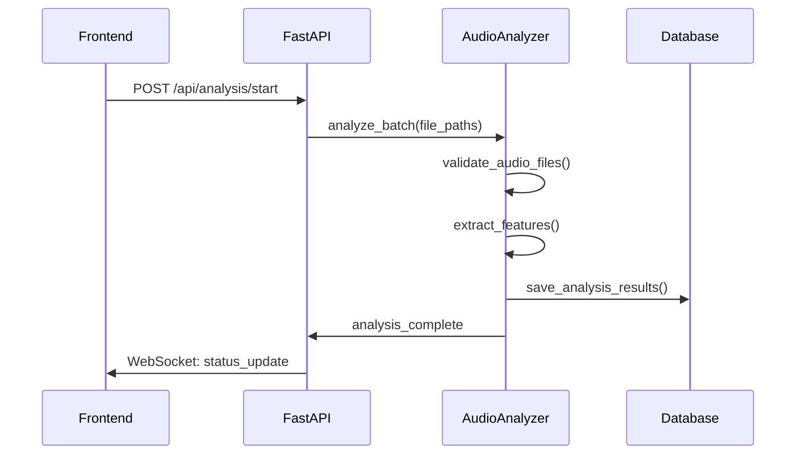
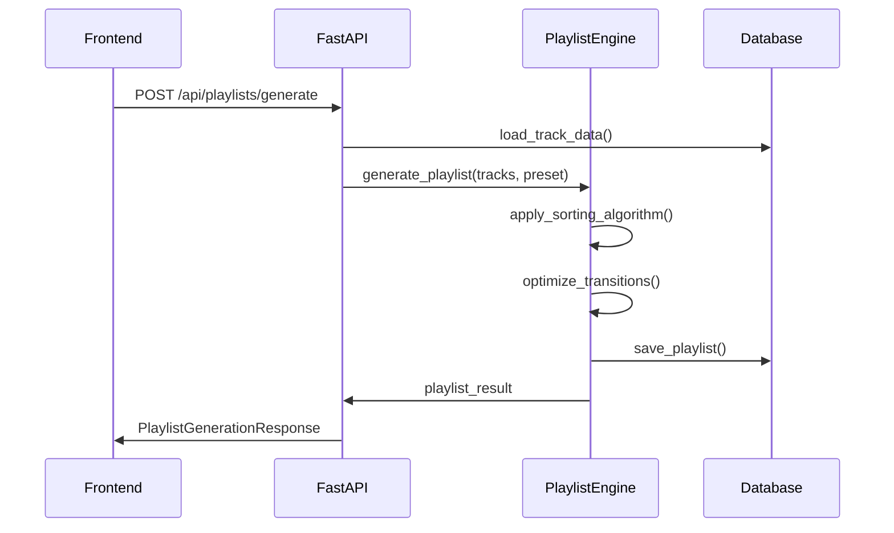
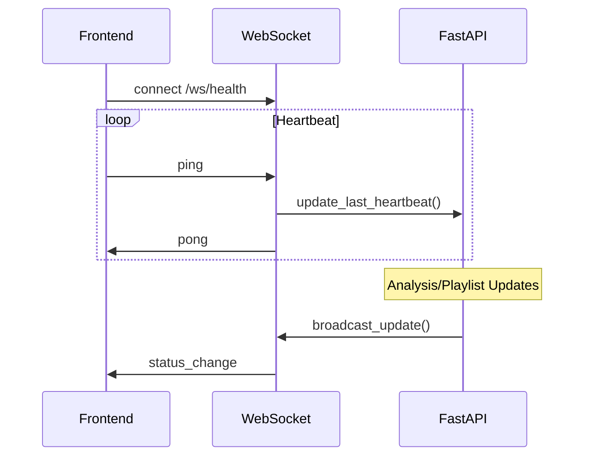

# DJ Audio-Analyse-Tool Pro - Systemdokumentation

## Inhaltsverzeichnis

1. [Systemübersicht](#systemübersicht)
2. [Architektur](#architektur)
3. [Backend-Komponenten](#backend-komponenten)
4. [Frontend-Komponenten](#frontend-komponenten)
5. [Datenfluss](#datenfluss)
6. [API-Dokumentation](#api-dokumentation)
7. [Konfiguration](#konfiguration)
8. [Installation & Setup](#installation--setup)
9. [Entwicklung](#entwicklung)
10. [Testing](#testing)
11. [Deployment](#deployment)
12. [Troubleshooting](#troubleshooting)

---

## Systemübersicht

### Zweck
Das DJ Audio-Analyse-Tool Pro ist eine professionelle Anwendung zur automatisierten Analyse von Audio-Dateien und intelligenten Playlist-Generierung für DJs und Musikproduzenten.

### Hauptfunktionen
- **Audio-Analyse**: Extraktion von BPM, Key, Energy, Mood und weiteren Audio-Features
- **Harmonic Mixing**: Camelot Wheel-basierte Kompatibilitätsanalyse
- **Intelligente Playlist-Generierung**: Verschiedene Algorithmen für optimale Track-Übergänge
- **Mood-Klassifikation**: Automatische Stimmungsanalyse mit ML- und heuristischen Ansätzen
- **Export-Funktionen**: M3U, JSON, CSV, Rekordbox-kompatible Formate
- **Real-time Monitoring**: WebSocket-basierte Live-Updates

### Technologie-Stack
- **Backend**: Python 3.8+, FastAPI, SQLite, librosa, essentia
- **Frontend**: React 18, TypeScript, Material-UI, React Query
- **Audio-Processing**: librosa, essentia (optional), mutagen
- **Machine Learning**: LightGBM (optional), NumPy, SciPy
- **Database**: SQLite mit optimierten Indizes
- **API**: RESTful API mit WebSocket-Support

---

## Architektur

### Gesamtarchitektur
```
┌─────────────────────────────────────────────────────────────┐
│                    Frontend (React/TS)                     │
├─────────────────────────────────────────────────────────────┤
│  Dashboard │ Library │ Analysis │ Creator │ Settings       │
└─────────────────────┬───────────────────────────────────────┘
                      │ HTTP/WebSocket API
┌─────────────────────▼───────────────────────────────────────┐
│                  FastAPI Backend                           │
├─────────────────────────────────────────────────────────────┤
│  API Endpoints │ WebSocket │ Middleware │ Exception Handler │
└─────────────────────┬───────────────────────────────────────┘
                      │
┌─────────────────────▼───────────────────────────────────────┐
│                   Core Engine                              │
├─────────────────────────────────────────────────────────────┤
│ Audio Analysis │ Playlist Engine │ Mood Classifier │ Export │
└─────────────────────┬───────────────────────────────────────┘
                      │
┌─────────────────────▼───────────────────────────────────────┐
│              Data Management Layer                         │
├─────────────────────────────────────────────────────────────┤
│  Database Manager │ Cache Manager │ File System Access     │
└─────────────────────────────────────────────────────────────┘
```

### Modulare Struktur
```
Audio_Analyse_tool/
├── backend/                    # Python Backend
│   ├── main.py                 # FastAPI Hauptanwendung
│   ├── api/                    # API Layer
│   │   ├── endpoints/          # REST Endpoints
│   │   └── models.py           # Pydantic Models
│   ├── core_engine/            # Business Logic
│   │   ├── audio_analysis/     # Audio-Analyse Engine
│   │   ├── playlist_engine/    # Playlist-Generierung
│   │   ├── mood_classifier/    # Stimmungsklassifikation
│   │   ├── data_management/    # Datenmanagement
│   │   └── export/             # Export-Funktionen
│   └── config/                 # Konfiguration
├── src/                        # React Frontend
│   ├── components/             # UI Komponenten
│   ├── pages/                  # Hauptseiten
│   ├── hooks/                  # Custom React Hooks
│   ├── types/                  # TypeScript Definitionen
│   └── utils/                  # Hilfsfunktionen
├── data/                       # Daten & Cache
├── config/                     # Globale Konfiguration
└── tests/                      # Test Suite
```

---

## Backend-Komponenten

### 1. FastAPI Hauptanwendung (`main.py`)

**Zweck**: Zentrale Anwendungslogik und Server-Setup

**Hauptfunktionen**:
- FastAPI App-Initialisierung mit Lifespan-Management
- CORS und Security Middleware
- Global Exception Handler
- WebSocket Heartbeat für Frontend-Verbindung
- Health Check und Status Endpoints
- Watchdog-System für automatischen Shutdown bei Frontend-Disconnect

**Wichtige Features**:
```python
# Lifespan Management
@asynccontextmanager
async def lifespan(app: FastAPI):
    # Startup: Initialisierung von Cache, Logging, Watchdog
    yield
    # Shutdown: Cleanup

# WebSocket Heartbeat
@app.websocket("/ws/health")
async def websocket_health_endpoint(websocket: WebSocket):
    # Überwacht Frontend-Verbindung
```

### 2. Audio Analysis Engine

#### AudioAnalyzer (`core_engine/audio_analysis/analyzer.py`)
**Zweck**: Hauptkomponente für Audio-Feature-Extraktion

**Unterstützte Formate**:
- Standard: MP3, WAV, FLAC, AAC, OGG, M4A
- Erweitert: AIFF, AU, WMA, MP4, 3GP, AMR, OPUS, WebM, MKV

**Feature-Extraktion**:
- **Tempo**: BPM-Erkennung mit librosa/essentia
- **Harmonik**: Key-Erkennung und Camelot Wheel Mapping
- **Energie**: RMS Energy, Spectral Centroid
- **Stimmung**: Valence, Danceability, Acousticness
- **Zeitreihen**: Frame-basierte Feature-Extraktion

**Multiprocessing-Support**:
```python
class AudioAnalyzer:
    def __init__(self, enable_multiprocessing=True):
        self.max_workers = min(mp.cpu_count() or 1, 8)
        
    def analyze_batch(self, file_paths: List[str]):
        # Parallele Verarbeitung mit ProcessPoolExecutor
```

#### FeatureExtractor (`core_engine/audio_analysis/feature_extractor.py`)
**Zweck**: Low-level Feature-Extraktion mit librosa/essentia

**Algorithmen**:
- **BPM**: Onset-basierte Tempo-Erkennung
- **Key**: Chroma-Feature-basierte Tonart-Erkennung
- **Energy**: RMS und Spectral Features
- **Camelot Mapping**: Automatische Konvertierung zu Camelot Notation

### 3. Playlist Engine

#### PlaylistEngine (`core_engine/playlist_engine/playlist_engine.py`)
**Zweck**: Intelligente Playlist-Generierung mit verschiedenen Algorithmen

**Verfügbare Algorithmen**:
1. **Harmonic Mixing**: Camelot Wheel-basierte Übergänge
2. **Energy Flow**: Energie-Verlauf-optimierte Sortierung
3. **Mood Progression**: Stimmungs-kohärente Abfolgen
4. **BPM Transition**: Sanfte BPM-Übergänge
5. **Hybrid Smart**: Kombination aller Algorithmen

**Standard-Presets**:
- **DJ Set - Harmonic Flow**: Professionelle DJ-Sets
- **Party Mix - Energy Build**: Energie-aufbauende Partylisten
- **Chill Session**: Entspannte Hintergrundmusik
- **Peak Time**: Hochenergetische Prime-Time-Sets
- **Warm-Up Set**: Sanfte Club-Einstiege

**Regel-System**:
```python
@dataclass
class PlaylistRule:
    name: str
    description: str
    weight: float  # 0.0 - 1.0
    enabled: bool = True
    parameters: Dict[str, Any] = field(default_factory=dict)
```

### 4. Mood Classifier

#### MoodClassifier (`core_engine/mood_classifier/mood_classifier.py`)
**Zweck**: Automatische Stimmungsklassifikation

**Mood-Kategorien**:
- Euphoric, Driving, Dark, Chill, Melancholic
- Aggressive, Uplifting, Mysterious, Neutral

**Klassifikationsansätze**:
1. **Heuristisch**: Regel-basierte Klassifikation
2. **Machine Learning**: LightGBM-basiert (optional)
3. **Hybrid**: Kombination beider Ansätze

**Feature-Gewichtung**:
```python
"feature_weights": {
    "energy": 1.0,
    "valence": 1.0,
    "bpm": 0.8,
    "danceability": 0.9,
    "loudness": 0.7,
    "spectral_centroid": 0.6,
    "mode": 0.5
}
```

### 5. Data Management

#### DatabaseManager (`core_engine/data_management/database_manager.py`)
**Zweck**: SQLite-basierte Datenpersistierung

**Schema**:
- **tracks**: Haupttabelle für Track-Informationen
- **analysis_cache**: Cache für Analyse-Ergebnisse
- **playlists**: Generierte Playlists
- **user_presets**: Benutzerdefinierte Presets

**Optimierungen**:
- Indizes auf häufig abgefragte Felder
- Batch-Insert für bessere Performance
- Connection Pooling für Multiprocessing

#### CacheManager (`core_engine/data_management/cache_manager.py`)
**Zweck**: Intelligentes Caching-System

**Features**:
- Automatische Cache-Invalidierung
- Kompression für große Dateien
- TTL-basierte Cleanup
- Memory + Disk Cache

### 6. API Layer

#### Endpoints (`api/endpoints/`)
**Struktur**:
- `tracks.py`: Track-Management und Suche
- `playlists.py`: Playlist-Generierung und -Management
- `analysis.py`: Analyse-Tasks und Status
- `config.py`: Konfigurationsmanagement

**Pydantic Models** (`api/models.py`):
- Request/Response Validierung
- Type Safety
- Automatische API-Dokumentation

---

## Frontend-Komponenten

### 1. Hauptseiten

#### Dashboard (`src/pages/Dashboard.tsx`)
**Zweck**: Zentrale Übersicht und Schnellzugriff

**Features**:
- Statistik-Cards (Tracks, BPM, Cache Hit Rate)
- Schnellzugriff-Buttons
- Letzte Aktivitäten
- Real-time Updates via React Query

#### Library (`src/pages/Library.tsx`)
**Zweck**: Track-Bibliothek mit Suche und Filterung

#### AnalysisCenter (`src/pages/AnalysisCenter.tsx`)
**Zweck**: Audio-Analyse-Management

#### CreatorStudio (`src/pages/CreatorStudio.tsx`)
**Zweck**: Playlist-Generierung und -Bearbeitung

### 2. Custom Hooks

#### useTracksQuery (`src/hooks/useTracksQuery.ts`)
**Zweck**: Track-Daten-Management mit React Query

```typescript
export const useTracksQuery = (params: TracksQueryParams) => {
  return useQuery({
    queryKey: ['tracks', params],
    queryFn: () => fetchTracks(params),
    staleTime: 30000,
    refetchInterval: 60000
  });
};
```

#### useAnalysisQuery (`src/hooks/useAnalysisQuery.ts`)
**Zweck**: Analyse-Status und -Management

#### useHeartbeat (`src/hooks/useHeartbeat.ts`)
**Zweck**: WebSocket-Verbindung zum Backend

### 3. TypeScript Interfaces

#### Haupttypen (`src/types/interfaces.ts`):
- `TrackSummary`: Kompakte Track-Information
- `TrackDetails`: Vollständige Track-Daten
- `TracksListResponse`: API-Response für Track-Listen
- `AnalysisStatusResponse`: Analyse-Status
- `PlaylistGenerationResponse`: Playlist-Generierung

---

## Datenfluss

### 1. Audio-Analyse-Workflow



### 2. Playlist-Generierung-Workflow



### 3. Real-time Updates



---

## API-Dokumentation

### Base URL
```
http://localhost:8000/api
```

### Hauptendpunkte

#### Tracks
- `GET /tracks` - Track-Liste mit Filterung
- `GET /tracks/{file_path}` - Track-Details
- `GET /tracks/stats` - Track-Statistiken

#### Analysis
- `POST /analysis/start` - Analyse starten
- `GET /analysis/status/{task_id}` - Analyse-Status
- `DELETE /analysis/{task_id}` - Analyse abbrechen

#### Playlists
- `POST /playlists/generate` - Playlist generieren
- `GET /playlists` - Playlist-Liste
- `GET /playlists/{playlist_id}` - Playlist-Details
- `POST /playlists/export` - Playlist exportieren

#### Config
- `GET /config/presets` - Verfügbare Presets
- `POST /config/presets` - Preset erstellen
- `GET /config/settings` - Systemeinstellungen

### WebSocket Endpoints
- `/ws/health` - Heartbeat-Verbindung
- `/ws/analysis` - Analyse-Updates
- `/ws/playlists` - Playlist-Updates

---

## Konfiguration

### Backend-Konfiguration (`backend/config/settings.py`)

**Hauptkategorien**:
- **Server**: Host, Port, CORS, Security
- **Audio Analysis**: Formate, Multiprocessing, Cache
- **Playlist Engine**: Presets, Algorithmen
- **Mood Classifier**: ML-Modelle, Gewichtungen
- **Database**: Pfade, Optimierungen
- **Logging**: Level, Rotation, Format

**Beispiel-Konfiguration**:
```python
"audio_analysis": {
    "cache_dir": "data/cache",
    "enable_multiprocessing": True,
    "max_workers": 8,
    "supported_formats": [".mp3", ".wav", ".flac"],
    "sample_rate": 44100,
    "analysis_timeout_seconds": 300
}
```

### Frontend-Konfiguration

**Environment Variables**:
```bash
REACT_APP_API_BASE_URL=http://localhost:8000/api
REACT_APP_WS_BASE_URL=ws://localhost:8000/ws
REACT_APP_ENABLE_DEBUG=false
```

**Default Config** (`src/types/interfaces.ts`):
```typescript
export const defaultAppProps: Required<AppProps> = {
  initialPage: NavigationPage.LIBRARY,
  apiBaseUrl: 'http://localhost:8000/api',
  enableRealTimeUpdates: true,
  defaultTheme: 'dark'
};
```

---

## Installation & Setup

### Systemanforderungen
- **Python**: 3.8 oder höher
- **Node.js**: 16.0 oder höher
- **RAM**: Mindestens 4GB (8GB empfohlen)
- **Speicher**: 2GB für Cache und Datenbank

### Backend-Setup

1. **Dependencies installieren**:
```bash
cd backend
pip install -r requirements.txt
```

2. **Optionale Dependencies**:
```bash
# Für erweiterte Audio-Analyse
pip install essentia-tensorflow

# Für ML-basierte Mood-Klassifikation
pip install lightgbm
```

3. **Datenbank initialisieren**:
```bash
python -c "from core_engine.data_management.database_manager import DatabaseManager; DatabaseManager('data/database.db').init_database()"
```

4. **Server starten**:
```bash
python -m uvicorn main:app --reload --host 0.0.0.0 --port 8000
```

### Frontend-Setup

1. **Dependencies installieren**:
```bash
cd src
npm install
```

2. **Development Server starten**:
```bash
npm start
```

3. **Production Build**:
```bash
npm run build
```

### Monorepo-Setup

**Alles auf einmal starten**:
```bash
npm run monorepo:dev
```

**Batch-Skripte** (Windows):
```batch
# start-dev.bat
@echo off
start "Backend" cmd /k "cd backend && python -m uvicorn main:app --reload"
start "Frontend" cmd /k "cd src && npm start"
```

---

## Entwicklung

### Code-Struktur-Richtlinien

**Backend**:
- Verwende Type Hints für alle Funktionen
- Pydantic Models für API-Validierung
- Async/Await für I/O-Operationen
- Logging für alle wichtigen Operationen
- Exception Handling mit spezifischen Error-Types

**Frontend**:
- TypeScript für Type Safety
- React Hooks für State Management
- Material-UI für konsistentes Design
- React Query für Server State
- Custom Hooks für wiederverwendbare Logik

### Testing-Strategie

**Backend Tests** (`tests/`):
- **Unit Tests**: Einzelne Komponenten
- **Integration Tests**: API-Endpoints
- **Performance Tests**: Audio-Analyse-Geschwindigkeit

**Test-Ausführung**:
```bash
# Alle Tests
pytest

# Mit Coverage
pytest --cov=backend

# Spezifische Tests
pytest tests/unit/test_audio_analyzer.py
```

**Frontend Tests**:
```bash
cd src
npm test
```

### Debugging

**Backend-Debugging**:
- FastAPI automatische Docs: `http://localhost:8000/docs`
- Logging-Level in `config/settings.py` anpassen
- Health Check: `http://localhost:8000/health`

**Frontend-Debugging**:
- React Developer Tools
- Network Tab für API-Calls
- Console Logs für State Changes

---

## Deployment

### Docker-Setup

**Dockerfile** (Backend):
```dockerfile
FROM python:3.9-slim
WORKDIR /app
COPY requirements.txt .
RUN pip install -r requirements.txt
COPY . .
EXPOSE 8000
CMD ["uvicorn", "main:app", "--host", "0.0.0.0", "--port", "8000"]
```

**Docker Compose**:
```yaml
version: '3.8'
services:
  backend:
    build: ./backend
    ports:
      - "8000:8000"
    volumes:
      - ./data:/app/data
  
  frontend:
    build: ./src
    ports:
      - "3000:3000"
    depends_on:
      - backend
```

### Production-Konfiguration

**Backend**:
- Gunicorn als WSGI Server
- Nginx als Reverse Proxy
- SSL/TLS Zertifikate
- Environment-basierte Konfiguration

**Frontend**:
- Optimized Production Build
- CDN für Static Assets
- Gzip Compression

---

## Troubleshooting

### Häufige Probleme

#### 1. Audio-Analyse schlägt fehl
**Symptome**: Fehler beim Laden von Audio-Dateien
**Lösungen**:
- Überprüfe unterstützte Formate
- Installiere fehlende Audio-Codecs
- Prüfe Dateiberechtigungen

#### 2. Langsame Performance
**Symptome**: Lange Analyse-Zeiten
**Lösungen**:
- Aktiviere Multiprocessing
- Erhöhe Cache-Größe
- Reduziere Batch-Größe

#### 3. WebSocket-Verbindung bricht ab
**Symptome**: Frontend verliert Verbindung
**Lösungen**:
- Prüfe Firewall-Einstellungen
- Erhöhe Heartbeat-Timeout
- Überprüfe Proxy-Konfiguration

#### 4. Speicher-Probleme
**Symptome**: Out of Memory Errors
**Lösungen**:
- Reduziere max_workers
- Aktiviere Cache-Cleanup
- Erhöhe System-RAM

### Logging und Monitoring

**Log-Dateien**:
- Backend: `logs/backend.log`
- Analyse: `logs/analysis.log`
- Fehler: `logs/error.log`

**Monitoring-Endpoints**:
- Health: `/health`
- Metrics: `/api/status`
- Cache Stats: `/api/cache/stats`

### Performance-Optimierung

**Backend**:
- Database-Indizes optimieren
- Cache-Hit-Rate überwachen
- Multiprocessing-Parameter anpassen

**Frontend**:
- React Query Cache-Konfiguration
- Lazy Loading für große Listen
- Virtualisierung für Track-Tabellen

---

## Erweiterungen und Roadmap

### Geplante Features
- **Cloud-Integration**: Spotify/Apple Music API
- **Advanced ML**: Deep Learning für Mood-Klassifikation
- **Real-time Analysis**: Live-Audio-Stream-Analyse
- **Collaborative Playlists**: Multi-User-Support
- **Mobile App**: React Native Implementation

### Plugin-System
- **Audio-Effekte**: VST-Plugin-Integration
- **Custom Algorithms**: User-definierte Sortier-Algorithmen
- **Export-Formate**: Zusätzliche DJ-Software-Unterstützung

---

*Dokumentation erstellt am: $(date)*
*Version: 2.0.0*
*Letzte Aktualisierung: $(date)*