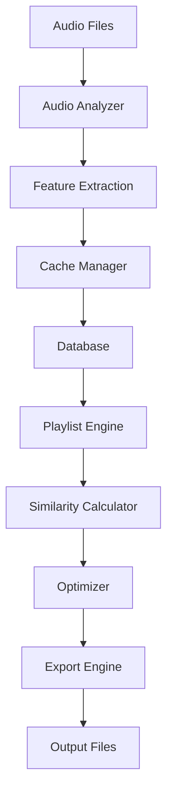

# 🛠️ Developer Guide

## 🏗️ Architektur-Übersicht

### 📦 Modulstruktur

```
src/
├── audio_analysis/     # Audio-Analyse-Engine
│   ├── analyzer.py     # Haupt-Analyzer
│   ├── bpm_detector.py # BPM-Erkennung
│   ├── key_detector.py # Tonart-Erkennung
│   └── feature_extractor.py # Spektrale Features
├── playlist_engine/    # Playlist-Generierung
│   ├── algorithms/     # Verschiedene Algorithmen
│   ├── similarity.py   # Track-Ähnlichkeit
│   └── optimizer.py    # Playlist-Optimierung
├── core/              # Kern-Komponenten
│   ├── cache_manager.py # Cache-System
│   ├── config_manager.py # Konfiguration
│   └── database.py     # Datenbank-Interface
├── gui/               # Benutzeroberfläche
│   ├── main_window.py  # Hauptfenster
│   ├── components/     # UI-Komponenten
│   └── dialogs/        # Dialog-Fenster
├── export/            # Export-Engine
│   ├── base_exporter.py # Basis-Klasse
│   ├── m3u_exporter.py  # M3U-Export
│   └── rekordbox_exporter.py # Rekordbox-Export
└── utils/             # Hilfsfunktionen
    ├── audio_utils.py  # Audio-Utilities
    └── file_utils.py   # Datei-Utilities
```

### 🔄 Datenfluss



## 🧩 Core Components

### AudioAnalyzer

```python
from src.audio_analysis.analyzer import AudioAnalyzer

# Initialisierung
analyzer = AudioAnalyzer(
    use_essentia=True,
    cache_enabled=True,
    max_workers=4
)

# Einzelne Datei analysieren
result = analyzer.analyze_file('path/to/track.mp3')
print(f"BPM: {result.bpm}, Key: {result.key}")

# Batch-Analyse
results = analyzer.analyze_batch([
    'track1.mp3',
    'track2.mp3',
    'track3.mp3'
])

# Erweiterte Features
features = analyzer.extract_features('track.mp3', [
    'mfcc',
    'chroma',
    'spectral_centroid',
    'zero_crossing_rate'
])
```

### PlaylistEngine

```python
from src.playlist_engine.engine import PlaylistEngine
from src.playlist_engine.algorithms import BeamSearchAlgorithm

# Engine initialisieren
engine = PlaylistEngine(
    algorithm=BeamSearchAlgorithm(),
    similarity_threshold=0.7
)

# Playlist erstellen
playlist = engine.create_playlist(
    tracks=track_list,
    target_length=60,  # Minuten
    energy_curve='gradual_buildup',
    key_compatibility=True
)

# Custom Constraints
constraints = {
    'bpm_range': (120, 130),
    'key_compatibility': True,
    'energy_progression': 'ascending',
    'avoid_artists': ['Artist1', 'Artist2']
}

playlist = engine.create_playlist(
    tracks=track_list,
    constraints=constraints
)
```

### CacheManager

```python
from src.core.cache_manager import CacheManager

# Cache initialisieren
cache = CacheManager(
    cache_dir='cache/',
    max_size_mb=1024,
    ttl_days=30
)

# Daten cachen
cache.set('track_123_bpm', 128.5)
cache.set('track_123_features', features_dict)

# Daten abrufen
bpm = cache.get('track_123_bpm')
if bpm is None:
    # Neu berechnen
    bpm = calculate_bpm(track)
    cache.set('track_123_bpm', bpm)

# Cache-Statistiken
stats = cache.get_stats()
print(f"Hit Rate: {stats.hit_rate:.2%}")
```

## 🔌 Plugin-System

### Custom Analyzer Plugin

```python
from src.audio_analysis.base import BaseAnalyzer

class CustomBPMAnalyzer(BaseAnalyzer):
    """Custom BPM-Analyzer Plugin"""
    
    def __init__(self, config=None):
        super().__init__(config)
        self.name = "custom_bpm"
        self.version = "1.0.0"
    
    def analyze(self, audio_data, sample_rate):
        """Implementiere custom BPM-Algorithmus"""
        # Custom BPM-Detection Logic
        bpm = self._detect_bpm(audio_data, sample_rate)
        
        return {
            'bpm': bpm,
            'confidence': self._calculate_confidence(bpm),
            'method': 'custom_algorithm'
        }
    
    def _detect_bpm(self, audio_data, sample_rate):
        # Implementierung hier
        pass

# Plugin registrieren
from src.core.plugin_manager import PluginManager
PluginManager.register_analyzer('custom_bpm', CustomBPMAnalyzer)
```

### Custom Export Plugin

```python
from src.export.base_exporter import BaseExporter

class SpotifyExporter(BaseExporter):
    """Spotify Playlist Exporter"""
    
    def __init__(self, client_id, client_secret):
        super().__init__()
        self.client_id = client_id
        self.client_secret = client_secret
        self.spotify_client = None
    
    def export(self, playlist, output_path=None):
        """Export zu Spotify"""
        # Spotify API Authentication
        self._authenticate()
        
        # Playlist erstellen
        spotify_playlist = self.spotify_client.user_playlist_create(
            user=self.user_id,
            name=playlist.name,
            description=playlist.description
        )
        
        # Tracks hinzufügen
        track_uris = self._find_spotify_tracks(playlist.tracks)
        self.spotify_client.playlist_add_items(
            playlist_id=spotify_playlist['id'],
            items=track_uris
        )
        
        return spotify_playlist['external_urls']['spotify']
```

## 🧪 Testing

### Unit Tests

```python
import pytest
from unittest.mock import Mock, patch
from src.audio_analysis.analyzer import AudioAnalyzer

class TestAudioAnalyzer:
    
    @pytest.fixture
    def analyzer(self):
        return AudioAnalyzer(use_essentia=False)
    
    @pytest.fixture
    def mock_audio_data(self):
        return {
            'audio': np.random.random(44100 * 30),  # 30s
            'sample_rate': 44100
        }
    
    def test_bpm_detection(self, analyzer, mock_audio_data):
        """Test BPM-Erkennung"""
        with patch('librosa.beat.tempo') as mock_tempo:
            mock_tempo.return_value = np.array([128.0])
            
            result = analyzer.detect_bpm(
                mock_audio_data['audio'],
                mock_audio_data['sample_rate']
            )
            
            assert result == 128.0
            mock_tempo.assert_called_once()
    
    def test_key_detection(self, analyzer, mock_audio_data):
        """Test Tonart-Erkennung"""
        result = analyzer.detect_key(
            mock_audio_data['audio'],
            mock_audio_data['sample_rate']
        )
        
        assert result in ['C', 'C#', 'D', 'D#', 'E', 'F', 
                         'F#', 'G', 'G#', 'A', 'A#', 'B']
    
    @pytest.mark.parametrize("file_format", [
        'mp3', 'wav', 'flac', 'aac'
    ])
    def test_supported_formats(self, analyzer, file_format):
        """Test unterstützte Dateiformate"""
        assert analyzer.is_supported_format(f"test.{file_format}")
```

### Integration Tests

```python
import pytest
from src.audio_analysis.analyzer import AudioAnalyzer
from src.playlist_engine.engine import PlaylistEngine
from src.export.m3u_exporter import M3UExporter

class TestFullWorkflow:
    
    @pytest.fixture
    def sample_tracks(self):
        return [
            'tests/fixtures/house_track_128bpm.mp3',
            'tests/fixtures/techno_track_130bpm.mp3',
            'tests/fixtures/progressive_track_126bpm.mp3'
        ]
    
    def test_complete_workflow(self, sample_tracks, tmp_path):
        """Test kompletter Workflow: Analyse → Playlist → Export"""
        
        # 1. Audio-Analyse
        analyzer = AudioAnalyzer()
        analyzed_tracks = []
        
        for track_path in sample_tracks:
            result = analyzer.analyze_file(track_path)
            analyzed_tracks.append(result)
        
        assert len(analyzed_tracks) == 3
        assert all(track.bpm > 0 for track in analyzed_tracks)
        
        # 2. Playlist-Erstellung
        engine = PlaylistEngine()
        playlist = engine.create_playlist(
            tracks=analyzed_tracks,
            target_length=10  # 10 Minuten
        )
        
        assert len(playlist.tracks) > 0
        assert playlist.total_duration <= 600  # 10 Min
        
        # 3. Export
        exporter = M3UExporter()
        output_file = tmp_path / "test_playlist.m3u"
        
        exporter.export(playlist, output_file)
        
        assert output_file.exists()
        assert output_file.stat().st_size > 0
```

### Performance Tests

```python
import time
import pytest
from src.audio_analysis.analyzer import AudioAnalyzer

class TestPerformance:
    
    def test_analysis_speed(self):
        """Test Analyse-Geschwindigkeit"""
        analyzer = AudioAnalyzer(max_workers=4)
        test_files = ['test1.mp3', 'test2.mp3', 'test3.mp3']
        
        start_time = time.time()
        results = analyzer.analyze_batch(test_files)
        end_time = time.time()
        
        analysis_time = end_time - start_time
        time_per_track = analysis_time / len(test_files)
        
        # Sollte unter 2 Sekunden pro Track sein
        assert time_per_track < 2.0
        
    def test_memory_usage(self):
        """Test Speicherverbrauch"""
        import psutil
        import os
        
        process = psutil.Process(os.getpid())
        initial_memory = process.memory_info().rss
        
        analyzer = AudioAnalyzer()
        # Analysiere viele Dateien
        for i in range(100):
            analyzer.analyze_file(f'test_{i}.mp3')
        
        final_memory = process.memory_info().rss
        memory_increase = final_memory - initial_memory
        
        # Speicherverbrauch sollte unter 500MB bleiben
        assert memory_increase < 500 * 1024 * 1024
```

## 🚀 Deployment

### PyInstaller Build

```python
# build.py
import PyInstaller.__main__
import os

def build_executable():
    """Erstelle ausführbare Datei"""
    
    PyInstaller.__main__.run([
        'main.py',
        '--name=DJ-Audio-Tool',
        '--windowed',
        '--onefile',
        '--icon=assets/icon.ico',
        '--add-data=config;config',
        '--add-data=templates;templates',
        '--add-data=assets;assets',
        '--hidden-import=essentia',
        '--hidden-import=librosa',
        '--exclude-module=matplotlib.tests',
        '--exclude-module=numpy.tests',
        '--optimize=2'
    ])

if __name__ == '__main__':
    build_executable()
```

### Docker Deployment

```dockerfile
# Dockerfile
FROM python:3.9-slim

# System-Dependencies
RUN apt-get update && apt-get install -y \
    ffmpeg \
    libsndfile1 \
    && rm -rf /var/lib/apt/lists/*

# Python-Dependencies
WORKDIR /app
COPY requirements.txt .
RUN pip install --no-cache-dir -r requirements.txt

# App-Code
COPY . .

# Konfiguration
ENV PYTHONPATH=/app
ENV QT_QPA_PLATFORM=offscreen

# Ports
EXPOSE 8000

# Start-Command
CMD ["python", "web_demo.py"]
```

### CI/CD Pipeline

```yaml
# .github/workflows/ci.yml
name: CI/CD Pipeline

on:
  push:
    branches: [ main, develop ]
  pull_request:
    branches: [ main ]

jobs:
  test:
    runs-on: ubuntu-latest
    strategy:
      matrix:
        python-version: [3.8, 3.9, '3.10', 3.11]
    
    steps:
    - uses: actions/checkout@v3
    
    - name: Set up Python ${{ matrix.python-version }}
      uses: actions/setup-python@v3
      with:
        python-version: ${{ matrix.python-version }}
    
    - name: Install system dependencies
      run: |
        sudo apt-get update
        sudo apt-get install -y ffmpeg libsndfile1
    
    - name: Install Python dependencies
      run: |
        python -m pip install --upgrade pip
        pip install -r requirements.txt
        pip install -r requirements-dev.txt
    
    - name: Run tests
      run: |
        pytest tests/ --cov=src --cov-report=xml
    
    - name: Upload coverage
      uses: codecov/codecov-action@v3
      with:
        file: ./coverage.xml
  
  build:
    needs: test
    runs-on: windows-latest
    if: github.ref == 'refs/heads/main'
    
    steps:
    - uses: actions/checkout@v3
    
    - name: Set up Python
      uses: actions/setup-python@v3
      with:
        python-version: 3.9
    
    - name: Build executable
      run: |
        pip install -r requirements.txt
        pip install pyinstaller
        python build.py
    
    - name: Upload artifact
      uses: actions/upload-artifact@v3
      with:
        name: DJ-Audio-Tool-Windows
        path: dist/DJ-Audio-Tool.exe
```

## 📊 Monitoring & Logging

### Performance Monitoring

```python
from src.core.monitoring import PerformanceMonitor
import time

class MonitoredAudioAnalyzer:
    
    def __init__(self):
        self.monitor = PerformanceMonitor()
    
    @self.monitor.track_performance
    def analyze_file(self, file_path):
        """Analysiere Datei mit Performance-Tracking"""
        start_time = time.time()
        
        try:
            result = self._do_analysis(file_path)
            
            # Metriken sammeln
            self.monitor.record_metric('analysis_time', 
                                     time.time() - start_time)
            self.monitor.record_metric('file_size', 
                                     os.path.getsize(file_path))
            
            return result
            
        except Exception as e:
            self.monitor.record_error('analysis_error', str(e))
            raise
    
    def get_performance_stats(self):
        """Performance-Statistiken abrufen"""
        return {
            'avg_analysis_time': self.monitor.get_avg('analysis_time'),
            'total_files_processed': self.monitor.get_count('analysis_time'),
            'error_rate': self.monitor.get_error_rate(),
            'throughput': self.monitor.get_throughput()
        }
```

### Structured Logging

```python
import logging
import json
from datetime import datetime

class StructuredLogger:
    
    def __init__(self, name):
        self.logger = logging.getLogger(name)
        self.logger.setLevel(logging.INFO)
        
        # JSON-Formatter
        formatter = logging.Formatter(
            '%(asctime)s - %(name)s - %(levelname)s - %(message)s'
        )
        
        # File-Handler
        file_handler = logging.FileHandler('logs/app.log')
        file_handler.setFormatter(formatter)
        self.logger.addHandler(file_handler)
    
    def log_analysis_start(self, file_path, file_size):
        self.logger.info(json.dumps({
            'event': 'analysis_start',
            'file_path': file_path,
            'file_size_mb': file_size / (1024 * 1024),
            'timestamp': datetime.now().isoformat()
        }))
    
    def log_analysis_complete(self, file_path, duration, result):
        self.logger.info(json.dumps({
            'event': 'analysis_complete',
            'file_path': file_path,
            'duration_seconds': duration,
            'bpm': result.get('bpm'),
            'key': result.get('key'),
            'timestamp': datetime.now().isoformat()
        }))
```

---

## 🔗 Weitere Ressourcen

- [API Reference](api/README.md) - Detaillierte API-Dokumentation
- [Plugin Development](plugins/README.md) - Plugin-Entwicklung
- [Performance Tuning](performance.md) - Performance-Optimierung
- [Security Guidelines](security.md) - Sicherheitsrichtlinien

> 💡 **Tipp**: Nutzen Sie die bereitgestellten Basis-Klassen und Interfaces für konsistente Plugin-Entwicklung!